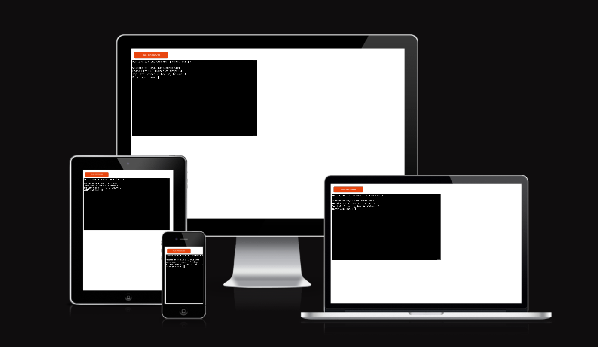

# Royal Battleship Game

Welcome to the Royal Battleship Game, a classic strategy board game brought to life in a digital format. Command your fleet and engage in thrilling naval warfare against the computer opponent.

Royal battleship Game is a Python terminal game, which runs in the Code Institute mock terminal on Heroku.

Experience the excitement of naval battles on interactive game boards made up of "0" for open waters, "X" for missed shots, "$" for player's formidable fleet, and "*" for victorious hits.

[Here You can explore the interactive version of my project.](https://battleship-game-royal-c7a32859a6d0.herokuapp.com/)

## How to play

**Placement Phase**:

Watch as your fleet is generated in random positions on the 5x5 game board, hidden from the computer opponent's view.

**Engagement Phase**:

Take turns with the computer, calling out coordinates to locate and destroy each other's ships. Use the feedback on hits and misses to refine your strategy.

**Victory**:

The first commander to sink the opponent's entire fleet claims victory. Will it be you or the 

## Features

### _Existing Features_

* Your fleet is positioned randomly on the 5x5 game board at the start of each game, introducing a strategic and unpredictable element.

* Effortlessly keep track of the game's progress with an intuitive scoring system, updating in real-time as players land hits or miss their shots.

* Engage with the game through a user-friendly input system, where players enter row and column coordinates with ease, enhancing the overall gaming experience.

* Ensure precision in gameplay by validating that user inputs consist only numbers.

* Implement strict checks to confirm that entered numbers fall within the 0 to 4 range.

* Enhance gameplay fairness by incorporating checks to disallow repeated guesses. 

### _Future Features_

* Allow players to customize the composition of their fleet before the game begins

* Implement a multiplayer mode, enabling players to compete against friends or other online opponents

## Data Model

* My game's data model begins with the creation of 5x5 game boards, initialized with "0" characters. The **make_board** function uses list comprehension for efficient creation. Ships, represented by "$," are randomly placed on the board using the **place_ships** function.

* The state of the game evolves dynamically as players make moves. The **hit_shot** function checks if a shot at specified coordinates hits a ship, facilitating the tracking of hits denoted by "*" and misses represented by "X" on the board.

* The **player_turn** and **computer_turn** functions handle the core gameplay logic. They prompt players for input, validate and process the moves, and update the game boards accordingly. The functions also print informative messages about hits and misses, contributing to the evolving data model during each turn.

## Testing

* Passed the code through an online PEP8 validator. No errors were identified.

* The game functionality was extensively tested in both local and Heroku terminal environments. This multi-environment testing ensures compatibility and functionality across different platforms.

*  The game input validation was thoroughly tested. The player's input, including row and column selections, was validated to ensure it meets the specified criteria.

## Bugs

### _Solved Bugs_

* "I encountered a deployment issue initially as I had generated a list of requirements but I did not installed any dependencies beforehand, making the requirements list unnecessary. 

* I had some typos and indentation issues.

## Remaining Bugs

* No remaining bugs

## Validator Testing

* No errors were returned from pep8ci.herokuapp.com

## Deployment

This project was deployed using Code Institute mock terminal for Heroku.

Steps of deployment :

1

